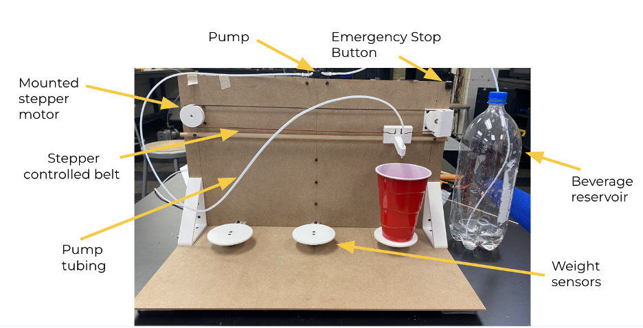

**Refresh-o-Matic:**

Authors: Volodymyr Semenov, Vasilisa Ignatova

                                                                                                       

Refresh-o-Matic is a drink dispensing system created with the goal of automating the process of filling and refilling drinks at a social event. The system seeks to accurately identify empty and partially filled cups given to the system and fill those cups while operating on a first-come-first-serve basis. 

**Operation:**

1) Prior to activating the system, the stepper has to be manually put at the zero position. To calibrate the stepper motor, manually move the belt connector to the middle of the backboard/at the position of the middle cup coaster.

2) Plug the 12V adapter attached to the back of the robot into a power supply to activate the system.

3) Place an empty or partially filled cup on one of the locations marked circular coasters located on the body of the robot.

The system will sense the presence of the cup as well as the amount of liquid located in the cup, and add it to a queue of cups that are ready to be filled.

Once all the earlier-placed cups are filled, the pump will travel to your cup and your drink will be poured, after which you can remove the cup from its position.

4) To deactivate the system, unplug the 12V adapter from the power supply.

**Notices:**

- You may remove the cup prematurely and the pump will cease its operation.

- An **emergency stop button** is located on the top right side of the robot backboard should you need to stop the system for any reason.

- The belt system should always be kept clear of obstructions for successful operation.

- The cup coasters/weight sensors should be kept clear of obstructions other than cups, for successful operation.

- The current system is designated to work **only** with standardized red solo cups

- The system code can be adjusted to support addition-sized cups and different desired pour amounts.
